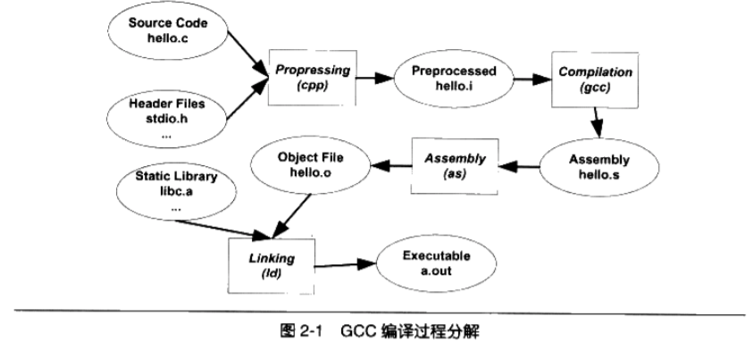

## Lab 0 工具链（开发环境搭建）

[toc]

### 0.1 实验内容简介

#### 0.1.1 实验目标

​		本次实验主要是为后续实验搭建开发环境、熟悉相应工具。

#### 0.1.2 开发环境

​		开发教学操作系统内核所需的环境如下：

- 类 Unix 操作系统（Ubuntu，Arch Linux 等）
- GCC
- GNU Make
- 版本管理 Git
- 模拟器 QEMU
- 调试工具 GDB

### 0.2 交叉编译工具链

​		编译是指将代码经过一系列步骤转换为可执行文件的过程。每个步骤都有对应的工具将前一步骤的输出作为输入进行相应处理，我们称这些工具为编译工具链，包括编译器（Compiler），汇编器（Assembler）和连接器（Linker）

															Fig.1[^程序员的自我修养] 

​													编译流程包括：预处理、编译、汇编、链接

​		交叉编译[^Cross-Compile] 是指在一种平台上编译出能在体系结构不同的另一种平台上运行的程序，交叉编译工具链即是该流程中所使用的工具。对应到我们的实验则是指，我们在 X86 架构的 PC 平台中编译出能在 ARM 架构 CPU 上运行的操作系统内核。

​		我们推荐以 Ubuntu，Arch Linux 、WSL 等平台作为开发环境，（以下教程基于 Ubuntu 18.04-LTS 环境配置）。可通过如下指令下载他人已经制作好的交叉编译工具链

```shell
sudo apt install gcc-aarch64-linux-gnu
```

​		完成上述操作后，可通过如下指令测试安装成功

```shell
aarch64-linux-gnu-gcc -v
```

​		显示内容如下，其中 Target 指示目标平台（ARMv8 架构下的 Linux 平台）。

```shell
COLLECT_GCC=aarch64-linux-gnu-gcc
COLLECT_LTO_WRAPPER=/usr/lib/gcc-cross/aarch64-linux-gnu/7/lto-wrapper
Target: aarch64-linux-gnu
Configured with: ...
Thread model: posix
gcc version 7.5.0 (Ubuntu/Linaro 7.5.0-3ubuntu1~18.04) 
```

​		对自己搭建完整工具链感兴趣的同学，可参考上文链接自行学习制作符合自己使用习惯的工具链。

### 0.3 QEMU 模拟器

​		我们的项目（预期）会在树莓派-3B 上运行，但在上板之前先通过模拟器模拟真实硬件环境来辅助调试内核会有效减少上板运行时出现错误的情况。QEMU 是一个广泛使用的开源计算机模拟器和虚拟机[^QEMU]，可以在一种架构（如 X86 PC）下运行另一种架构（如 ARM）下的操作系统和程序。可直接通过如下指令安装 QEMU

```shell
sudo apt install qemu qemu-system-arm qemu-efi-aarch64 qemu-utils
```

​		安装完成后可通过如下指令确认当前 QEMU 版本是否支持 `raspi3` 的 soc，如果不支持的话，请参考 **0.7 pwndbg** 小节手动编译 qemu。 

```shell
qemu-system-aarch64 -M help
```

### 0.4 GDB

​		系统自带的 gdb 并不支持跨平台的 debug，因此需要安装支持多体系结构的版本

```shell
sudo apt install -y build-essential gdb gdb-multiarch
```

### 0.5 Git

​		如果是对 git 很熟悉的同学可以跳过小节内容。

​		后续的整个项目的开发、维护建议通过 Git 来实现版本管理，首先需要安装 Git 工具。

```shell
sudo apt install git
```

​		为了完成后续的 Lab，你需要将本项目克隆下来

```shell
git clone https://github.com/FDUCSLG/OS-Autumn20-Fudan.git
```

​		进入到项目文件夹下后，切换至分支 `lab0`，即可在本地看到当前文档。

​		对通过 Git 进行版本管理感兴趣的同学可以参考 Git User Manual[^Git-manual] 进一步学习。

### 0.6 GNU Make

​		Make 会根据项目文件给定的依赖关系自动找出相应的文件进行编译[^Make 的意义]，因此每个项目都需要一个 “Makefile” 文件来指明依赖关系。Makefile 的规则如下

```makefile
target ...: prerequisites ...
	recipe
 	...
 	...
```

- target

  可以是一个 object file（目标文件），也可以是一个可执行文件，还可以是一个标签（label），例如 *clean*。

- prerequisites

  生成该 target 所依赖的文件和/或 target

- recipe

  该 target 要执行的命令（任意的 shell 命令）
  
  ​	对 Make 感兴趣的同学，可自行参考 tutorial [^Makefile-tutorial]进行学习。

### 0.7 pwndbg(optional)

​		仅仅是 gdb 的话，调试起来可能会不太美观（方便），建议安装 pwndbg

```shell
git clone https://github.com/pwndbg/pwndbg
cd pwndbg
./setup.sh
```

​		安装 pwndbg 后，普通的 gdb 可以配合 pwndbg 正常食用，但交叉编译的 `aarch64-linux-gdb` 会报各种错误，知乎专栏 *pwndbg 的坑*[^Zhihu] 给了我很多的帮助，此处需要注意 pwndbg 使用的 pip 版本信息。

​		4.2.0 版本的 QEMU 无法搭配 pwndbg 使用，因此可以通过下述指令获取 QEMU 5.1.0 的源码并手动编译。建议将 `configs/aarch64-softmmu` 下的 `qemu-system-aarch64` 复制到环境变量如 `usr/bin` 下，即可在 shell 下直接访问（`qemu-system-aarch64 -version` 显示版本应为 5.1.0）。

```shell
wget https://download.qemu.org/qemu-5.1.0.tar.xz
tar xvJf qemu-5.1.0.tar.xz
cd qemu-5.1.0
sudo apt-get build-dep qemu # 安装 QEMU 开发库

mkdir -p configs
cd configs/
./../configure --target-list=aarch64-softmmu --enable-debug # target-list 指定 configs 下 make 指令产生的 obj 放置位置
make ARCH=aarch64 CROSS_COMPILE=aarch64-linux-gnu- -j6
```

​		如果在完成将 QEMU 版本升级到 5.1.0 后仍然无法搭配 pwndbg 使用，则需要通过下述指令将 gdb 更新至最新版本。

```shell
wget http://ftp.gnu.org/gnu/gdb/gdb-9.2.tar.gz
tar -xvf gdb-9.2.tar.gz
cd gdb-9.2
mkdir build
cd build/
./../configure --target=aarch64-linux --prefix=/home/sunflower/Downloads/aarch64-linux-gdb # target 指定架构信息，prefix 指定 make 指令产生的 obj 放置位置
make -j6
make install
```

### 0.8 Exercise

#### 0.8.1 Git Exercise

​		请确保你当前处于 `OS-2020Fall-Fudan` 文件夹的 `lab0` 下，按顺序完成如下操作

- 通过 `git checkout -b dev` 创建、切换到 `dev` 分支
- 通过 `git branch -v` 可以查看所有本地分支，显示相应分支的信息，并指示当前所在分支
- 创建一个 `README.md` 文件，并写入你的名字和学号
- 通过 `git status` 可以查看当前分支下未保存的修改
- 通过 `git add` 和 `git commit` 来保存你的修改
- 通过 `git checkout lab0` 切换到 `lab0` 分支，通过 `git rebase dev` 将 `dev` 分支上的修改作用到 `lab0` 分支，如果出现了 conflicts 则根据指示进行合并
- 通过 `git log` 可以查看当前分支下的 log

请确认你清楚明白以下 `git` 指令的含义：

- git branch
- git checkout
- git add
- git commit
- git merge
- git rebase
- git push
- git pull
- git clone
- git log
- git status

#### 0.8.2 Makefile Exercise

​		请画出 `simple/Makefile` 中 make 命令的依赖关系。

### 0.9 参考文献

[^程序员的自我修养]:https://book.douban.com/subject/3652388/
[^Cross-Compile]:https://blog.csdn.net/hailin0716/article/details/17578767
[^QEMU]:https://wiki.archlinux.org/index.php/QEMU_(%E7%AE%80%E4%BD%93%E4%B8%AD%E6%96%87)
[^Git-manual]:https://mirrors.edge.kernel.org/pub/software/scm/git/docs/user-manual.html
[^Make 的意义]:https://blog.csdn.net/YEYUANGEN/article/details/36898505
[^Makefile-tutorial]:https://seisman.github.io/how-to-write-makefile/
[^Zhihu]:https://zhuanlan.zhihu.com/p/129837931
