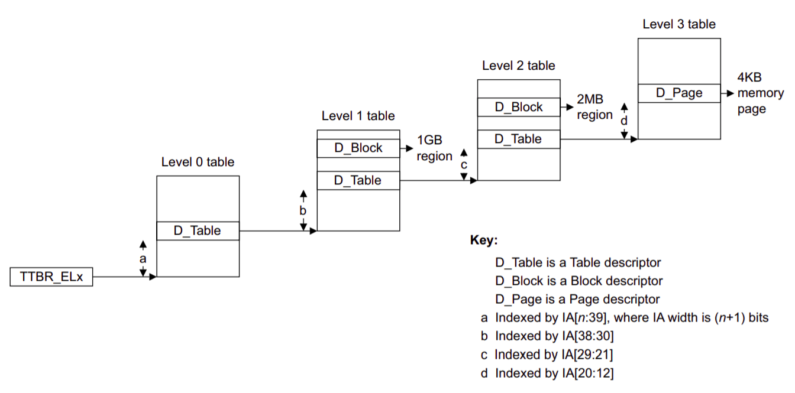

## Lab2 内存管理

[toc]

### 2.1 实验内容简介

#### 2.1.1 实验目标

　　内核主要负责四个任务：内存管理、进程调度、设备驱动以及系统调用[^RedHat]，我们在本学期的教学操作系统内核实验中均会涉及到。在本实验中，需要实现教学操作系统内核的内存管理系统。内存管理系统分为两部分：

- 内核的物理内存分配器，用于分配和回收物理内存
- 内核的页表，用于将虚拟地址映射到物理地址

#### 2.1.2 Git

　　在本次实验以及后续实验中，你需要根据文档指示自行实现教学操作系统的内核，我们仅会提供部分代码用于引导。每次发布新的 lab，均会开启一个新的分支，以下（并非强制性的）获取新 lab 的流程在后续实验中会经常出现。首先确保你当前所在分支为完成 lab1 实验的分支，假设为 `dev`。

```sh
git pull # 通过 git pull 获取 github 仓库中的更新
git checkout -b dev-lab2 # 从 dev 切换到新的分支 dev-lab2
git rebase origin/lab2 # 将 lab2 中的更新作用于 dev-lab2
work in lab2-dev branch...
git add files you've modified
git commit -m "balabala"
git checkout dev # 在生成新的 commit 后，切换回 dev
git rebase lab2-dev # 将 dev-lab2 中的修改作用于 dev，此时 dev 分支为完成 lab0-2 实验的分支
```

#### 2.1.3 参考文档

　　因为内核需要与硬件大量交互，将参考 ARM 架构文档来理解相关硬件配置。我们会在实验文档中给出需要参考 ARM 架构文档的哪部分，指代方式参考 Stanford 文档[^Stanford]。

- `ref: C5.2` 指示相关部分在 [ARMv8 Reference Manual](https://cs140e.sergio.bz/docs/ARMv8-Reference-Manual.pdf) 的 C5.2
- `A53: 4.3.30` 指示相关部分在 [ARM Cortex-A53 Manual](https://cs140e.sergio.bz/docs/ARM-Cortex-A53-Manual.pdf) 的 4.3.30
- `guide: 10.1` 指示相关部分在 [ARMv8-A Programmer Guide](https://cs140e.sergio.bz/docs/ARMv8-A-Programmer-Guide.pdf) 的 10.1

### 2.2 物理内存管理

　　物理内存是指 DRAM 中的储存单元，每个字节的物理内存都有一个地址，称为物理地址；虚拟内存是程序（用户进程、内核）看到的存储空间。在本实验中，你需要为内核实现一个物理内存分配器为后续用户进程的页表、栈等分配空间。

　　内核会将物理内存中内核代码后（`PHYSTOP` 前）的物理内存用于分配，并且通过链表来管理空闲物理内存，分配即从链表中拿出一个物理页，回收将对应的物理页加入链表中。

　　物理内存分配器通过 `free_list` (kern/kalloc.c:20) 来管理所有空闲物理内存，`free_list` 即是链表头，链表中的每个节点是一个 `struct run` (kern/kalloc.c:15) 用来代表每个空闲页，那么 `struct run` 存在哪里呢？

　　进入内核代码后，内核会通过 `alloc_init` 将所有可用的物理内存回收。`end` 定义在链接器脚本 `kern/linker.ld` 中用于指示内核代码的终止，`free_range` 通过 `ROUNDUP` (kern/kalloc.c:48) 保证给定的空闲内存段首地址是按页对齐。`kfree` 将给定页的内容全置为 1 使得对空闲内存的访问无法获得原有内容方便调试。

### 2.3 虚拟内存

　　虚拟内存与页表的管理（页的粒度、虚拟地址的大小等）与指令集架构密切相关，实验使用的 ARM 架构提供了三种页的粒度：64 KB(16 bits)，16 KB(14 bits)，4 KB(12 bits)，本学期的内核实验我们将采用 4 KB 的页大小，在 48-bit 索引的虚拟内存中虚拟地址通过页表转换为物理地址的过程如下图。



<center>Fig 2.1</center>

　　当拿到 64-bit 的虚拟地址时

- 如果前 16 位全 0，CPU 从 `ttbr0_el1` 读出 level-0 页表
- 如果前 16 位全 1，CPU 从 `ttbr1_el1` 开始 level-0 页表
- 否则，报错

　　拿到 level-0 页表后，va[47:39] 作为索引获取下一级页表信息（页表地址、访问权限），后续页表的翻译流程可见 Fig 2.1。

　　页表项 entry 后 12 位用于权限控制。在 level-1、level-2 中 entry[1] 可用于指示当前项的属性（为 0 时 block、为 1 时 table）**(ref:D4.3.1)**，在 level-3 中 entry[1] 只能为 1，指示当前项中包含物理地址 **(ref:D4.3.2)**，entry[0] 用于指示当前项是否有为空（可用于映射物理地址）**(ref:D4.3.2)**，entry[7:6] 用于权限管理 **(ref:D4.4.4)**。

　　`map_region` 函数用于在 `pgdir` 对应的页表上建立 `va` 到 `pa` 的映射，其中 `size` 为物理内存段的大小，`perm` 指代该段的权限。`vm_free` 用于回收页表 `pgdir` 占用的物理空间。

### 2.4 Exercise

#### 2.4.1 物理内存分配器

　　完成物理内存分配器的分配函数 `kalloc` 以及回收函数 `kfree`。

#### 2.4.2 页表管理

　　完成物理地址的映射函数 `map_region` 以及回收页表物理空间函数 `vm_free`。

### 2.5 参考文献

[^RedHat]:https://www.redhat.com/en/topics/linux/what-is-the-linux-kernel
[^Stanford]:https://cs140e.sergio.bz/assignments/3-spawn/