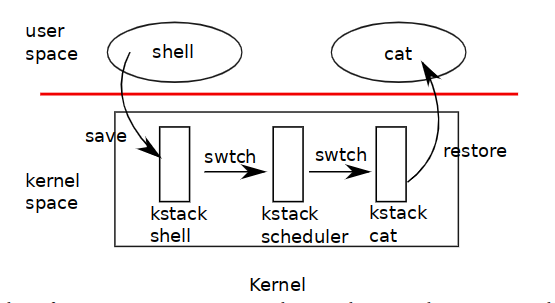

## Lab5 进程管理

[toc]

### 5.1 实验内容简介

#### 5.1.1 实验目标

　　在本次实验中，需要实现教学操作系统内核的进程管理部分，分为：

- 内核的进程管理模块，负责进程的创建、调度（执行）
- 内核的（简单）系统调用模块，负责响应用户进程请求的系统调用

最终实现将 `user/initcode.S` 作为第一个用户进程予以调度，并响应其执行过程中的系统调用。建议在实验中先切换为单处理器模式，确保单处理器下所有功能均正常，再切换为多处理器模式，以将并发问题与其他功能性问题做到分离。

#### 5.1.2 Git

　　首先，请将本次实验新增的代码并入你们的开发分支

```bash
git pull
git rebase origin/lab5
# Or git merge origin/lab5
```

如果出现 conflict，请按照 git 的提示进行即可。

#### 5.1.3 xv6 手册

　　本次实验可以参考 xv6 实验手册

- Chap1：Operating system organization 从 Code: creating the first process 开始到 Chap1 截止的部分
- Chap5：Scheduling 部分

### 5.2 进程管理

​		我们在 `inc/proc.h` 定义了 xv6 中进程的概念（本实验中仅需关注如下内容），每个进程都拥有自己的内核栈，页表（与对应的地址空间）以及上下文信息。

```c++
struct proc {
    uint64_t sz;             /* Size of process memory (bytes)          */
    uint64_t *pgdir;         /* Page table                              */
    char *kstack;            /* Bottom of kernel stack for this process */
    enum procstate state;    /* Process state                           */
    int pid;                 /* Process ID                              */
    struct proc *parent;     /* Parent process                          */
    struct trapframe *tf;    /* Trapframe for current syscall           */
    struct context *context; /* swtch() here to run process             */
};
```

#### 5.2.1 问题一

　　在 proc（即 PCB）中仅存储了进程的 trapframe 与 context 指针，请说明 trapframe 与 context 的实例存在何处，如果在 proc 中存储 `struct context context` 与 `struct trapframe tf` 应如何实现 trap 与 context switch？

#### 5.2.2 Context switch

　　context switch（即上下文切换）是操作系统多道程序设计（multitasking/multiprogramming）的重要组成部分，它实现了从一个进程切换到另一个进程，此时需要切换能准确描述当前进程在 CPU 上运行情况的上下文信息包括通用寄存器堆、运行时栈（即每个进程的内核栈）以及 PC（lr/x30 寄存器）。



当用户进程放弃 CPU 时，该进程的内核线程（kernel thread）会调用 `kern/swtch.S` 中的 `swtch` 来存储当前进程的上下文信息，并切换到内核调度器的上下文，每个进程的上下文信息均由 `struct proc` 的 `struct context*` 描述。请完成 `inc/proc.h` 中 `struct context` 的定义以及 `kern/swtch.S` 中 context switch 的实现。

#### 5.2.3 问题二

　　在 `kern/proc.c` 中将 `swtch` 声明为 `void swtch(struct context **, struct context *)`，如果声明为 `void swtch(struct context *, struct context *)` 应如何实现？`context` 中仅需要存储 callee-saved registers，请结合 PCS 说明为什么？与 trapframe 对比，请说明为什么 trapframe 需要存储这么多信息？trapframe **似乎** 已经包含了 context 中的内容，为什么上下文切换时还需要先 trap 再 switch？

>  For the Arm architecture, the Procedure Call Standard, or PCS specifies:
>
> - Which registers are used to pass arguments into the function.
> - Which registers are used to return a value to the function doing the calling, known as the caller.
> - Which registers the function being called, which is known as the callee, can corrupt.
> - Which registers the callee cannot corrupt.

　　PCS 是 ARM 架构在函数调用过程中通用寄存器的使用规范，当我们自己手写汇编，同时会借助其他开源工具如编译器生成汇编指令时，应当尽量遵守这个规范，以保证代码整体正确、高效。[^PCS]

#### 5.2.4 创建与调度进程

　　请根据 `kern/proc.c` 中相应代码的注释完成内核进程管理模块以支持调度第一个用户进程 `user/initcode.S`。因为当前内核中还没有文件系统，我们通过修改 Makefile 文件将 `initcode.S` 链接进了 kernel 中。大致流程为：首先将 `initcode.S` 编译、转换为 `obj/user` 下的二进制文件，再与 `kern` 目录下编译出的内核代码共同链接成内核的可执行文件，`make qemu` 后可在 `obj/kernel8.hdr` 的 symbol table 中发现与之相关的三个 symbol：\_binary_obj_user_initcode_size、\_binary_obj_user_initcode_start、\_binary_obj_user_initcode_end 来告知内核 `initcode` 的位置信息。

可参照如下顺序实现 `kern/proc` 下的函数

- proc_init 完成 ptable 锁的初始化
- user_init 初始化第一个用户进程 `user/initcode.S`
  - proc_alloc 创建一个进程
  - pgdir_init 为进程创建一张页表
  - uvm_init 将进程的页表初始化
- scheduler 内核开始调度
  - uvm_switch 为用户进程切换页表（ttbr0_el1）
  - swtch 从内核的调度器切换到用户进程
  - forkret 过渡，为以后的一些初始化留位置

### 5.3 系统调用

　　目前内核已经支持基本的异常处理，在本实验中还需要进一步完善内核的系统调用模块。用户进程通过系统调用来向操作系统内核请求服务以完成需要更高权限运行的任务。在 armv8 中，用户进程通过 `svc` 指令来请求系统调用，内核会根据 `ESR_EL1` 中的 `EC[31:26]` 以分派给相应的 handler 进行处理[^ESR_EL1]。

　　用户进程在请求系统调用时，应告知内核相应的 system call number 以及系统调用所需的参数信息，system call number 的宏定义可见 `inc/syscallno.h`。

可参照如下顺序实现

- 从 `alltraps` 跳转到 `kern/trap.c` 中的 `trap` 函数， 当因为系统调用而陷入时进入 `syscall` 中
- 在 `kern/syscall.c` 中的 `syscall` 中根据 system call number 跳转到相应的 handler 中。
- `sys_exec` 已经在 `kern/sysfile.c` 中实现，`sys_exit` 定义在了 `kern/sysproc.c` 中。
- 为 kernel thread 添加一个 sys_yield 操作，当用户进程当前时间片耗尽时， kernel thread 可以通过 yield 让用户进程放弃占用 CPU

在成功实现所有模块后，`make qemu` 在单处理器模式下应显示

```shell
main: [CPU0] is init kernel
main: Allocator: Init success.
irq_init: - irq init
main: [CPU0] Init success.
sys_exec: executing /init with parameters: /init 
sys_exit: in exit
```

在多处理器模式下应显示

```shell
qemu-system-aarch64 -M raspi3 -nographic -serial null -serial mon:stdio -kernel obj/kernel8.img
main: [CPU1] is init kernel
main: Allocator: Init success.
irq_init: - irq init
main: [CPU1] Init success.
main: [CPU2] Init success.
main: [CPU3] Init success.
main: [CPU0] Init success.
sys_exec: executing /init with parameters: /init 
sys_exit: in exit
```

### 5.4 参考文献

[^PCS]:https://developer.arm.com/architectures/learn-the-architecture/aarch64-instruction-set-architecture/procedure-call-standard
[^ESR_EL1]:https://developer.arm.com/docs/ddi0595/h/aarch64-system-registers/esr_el1