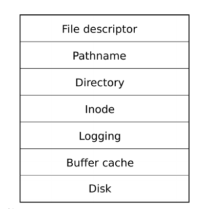
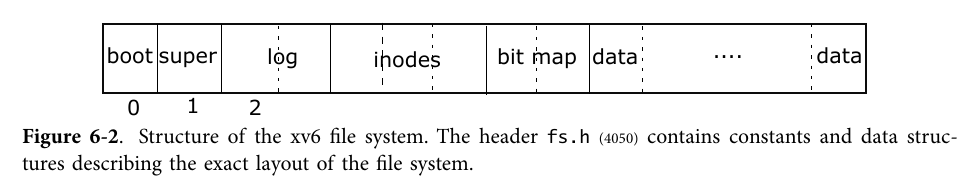

# Lab7 文件系统和 Shell

恭喜你来到 OS 的最后一关！在这一关中，你需要把之前写的所有代码都串联起来，并且添加大量新代码，以支持一个文件系统和一个简单的 shell。


## 7.1 文件系统

在 Lab 6 中，我们已经实现了一个 SD 卡的驱动，并且可以实现以 block 为单位的原子读写，我们接下来就在这个驱动的基础上实现文件系统。

简单来说，底层驱动为文件系统提供了一个线性寻址、单位为 section（512B）的可持久化存储空间。

然而这个访问方式过于原始，没有提供足够的抽象给程序员，因此出现了以文件为单位的抽象。这个抽象在 UNIX 操作系统中得到了发扬光大，出现了万物皆文件的统一界面，并通过系统调用，提供给了对程序员十分友好的编程范式。

而操作系统内的文件系统的意义就在与弥合从底层驱动到这一层系统调用界面之间的空隙。

建议阅读 OSTEP 的第三部分（或者笔者写过的一篇总结性文章《[文件系统及存储系统介绍](https://zfhu.ac.cn/homepage/2019/12/file-system-present)》）了解一些原理性的知识。

### 设计

因为独立实现一个正确的文件系统较为困难，我们建议参考 xv6 的文件系统实现，移植或者仿照其设计，在我们的 OS 框架上实现文件系统。

建议通读 xv6 book 的第 6 章，并根据其代码解释阅读 xv6 的源代码。因为我们已经实现了驱动，而在驱动之上实现文件系统与 CPU 的架构的相关性并不高，因此即使 xv6 book 所描述的是基于 x86 的操作系统，其文件系统部分的设计对于我们来说仍然具有较高的参加价值。

在 xv6 中，文件系统自底向上的结构如下图所示



相关的代码为

- `ide.c` 硬盘驱动，在我们的 Lab6 中已经由 sd.c 实现。
- `bio.c` buffer cache，对存储介质上的单位空间做 buffer，维护在内存中
- `log.c` 磁盘改动日志，用于维护系统调用的崩溃一致性（crash consistency）
- `fs.c` 对 inode 的操作的实现。
- `file.c` 文件抽象
- `sysfile.c` 和文件系统相关的各种系统调用
- `mkfs.c` 文件系统初始化，构建 superblock、log、inodes、bit map 等存储区域，并将用户态的程序写入文件系统

在存储介质上的内容组织如下图所示，其中 boot 包含了引导程序（注意到我们的操作系统本身实际上并不存储在我们的文件系统中），super 是文件系统的 superblock，包含了文件系统的元数据；log 存储了操作日志；inodes 是文件的元信息；bitmap 存储了 data 区域的使用情况。




## 7.2 系统调用

我们在之前的 lab 中已经实现了解了如何在 ARM 上实现系统调用，但当时主要的目的是通过时钟硬中断实现抢占式调度。而在添加文件系统后，我们需要引入大量软中断来实现用户态系统调用，与文件系统交互。

用户态使用系统调用，本质上是通过软中断指令完成的。然而用户不可能直接写指令，系统调用号也会随着操作系统的不同而改变，造成无法移植。因此会需要 `libc` 来提供函数调用的抽象，由 `libc` 在底层实现软中断指令的调用。

`xv6` 实现了一个非常简单的 `libc`，在 `syscall.h` 中定义了各个系统调用号，然后在 `usys.S` 中实现了对中断指令的封装。

而 `lab6` 引入了一个更加完善、但也更加复杂的 `libc`，即 `musl`。

你可以选择 `xv6` 形式的简单封装，也可以选择在 `musl` 的基础上实现，将文件系统的操作以系统调用的形式暴露给用户态。

注意 `libc` 需要一同参与用户态程序的编译，请对 Makefile 作出恰当的修改。


## 7.3 Shell

xv6 同样实现了一个简单的 shell。shell 是程序员与类 UNIX 操作系统交互的最自然的界面，因此如果想要真正把玩你这一学期以来实现的操作系统，你必须为其实现一个 shell。

在实现了文件系统和各个系统调用后，你可以把 shell 作为初始进程运行的第一个程序，并从 shell 通过 `./xxx` 来将文件系统中的可执行文件加载到内存中执行。


## 7.4 习题

### 7.4.1 习题 1 (60%)

请实现文件系统，本实验中的文件系统遵循 xv6 的设计，你也可以从 0 开始设计属于你的文件系统。如果你的文件系统不同于 xv6 的话，请修改 `user/src/mkfs`。你需要添加测试证明你实现的文件系统可以读取到你打包的文件，在数量、内容上是正确的。

建议通过修改 Makefile 添加新的编译项（如 `make testfs`），并使用 `-DTEST_FILE_SYSTEM` 的[条件编译指令](https://www.linuxtopia.org/online_books/an_introduction_to_gcc/gccintro_34.html)在代码中实现无侵入的测试

```c
#ifdef TEST_FILE_SYSTEM
test_file_system()
#endif

// compile with `gcc -DTEST_FILE_SYSTEM ...` so that the above code will be included. 
```

### 7.4.2 习题 2 (20%)

请修改 `syscall.c` 以及 `trapasm.S` 来接上 musl，或者修改 Makefile 并搬运 xv6 的简易 libc，从而允许用户态程序通过调用系统调用来操作文件系统。

### 7.4.3 习题 3 (20%)

我们已经把 xv6 的 shell 搬运到了 `/usr/src/sh` 目录下，但需要实现 brk 系统调用来使用 malloc，你也可以自行实现一个简单的 shell。请在 `usr/src/cat` 中实现 cat 命令并在你的 shell 中执行。

### 7.4.4 挑战课题

文件系统最重要的能力是在系统崩溃和恢复的时候不会出现数据不一致的情况。请你设计测试来验证文件系统的崩溃一致性。

